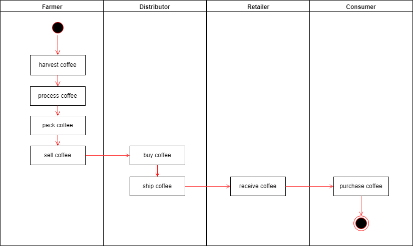
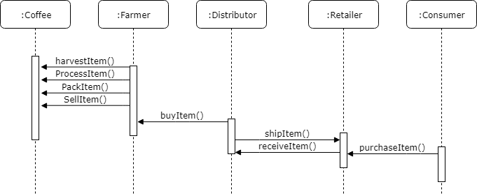
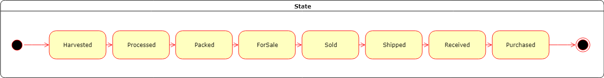
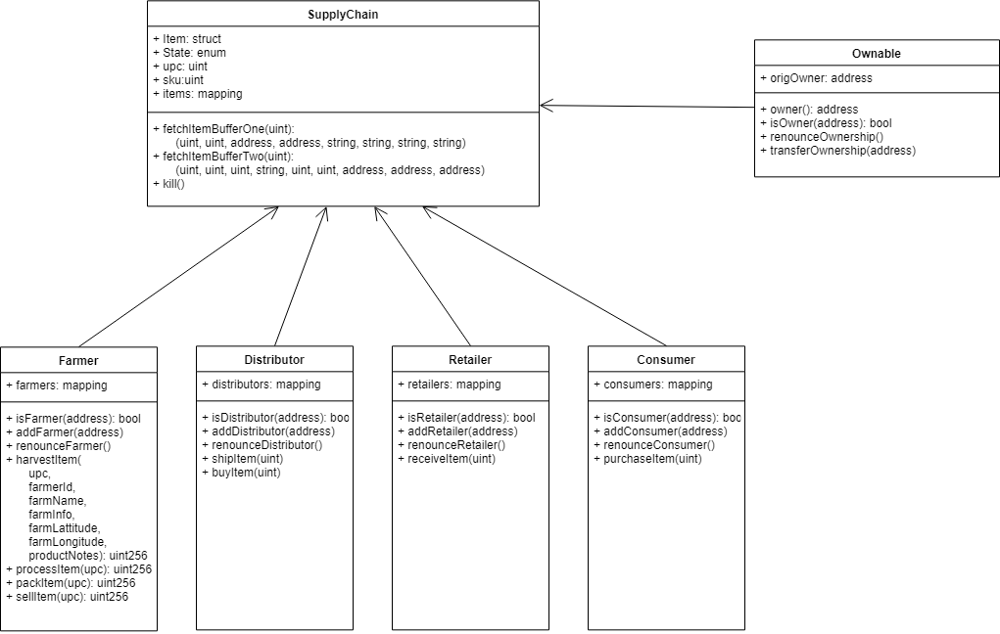
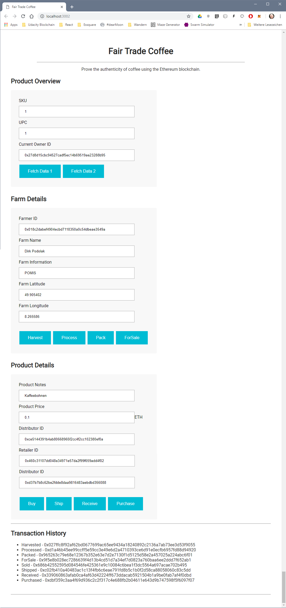

# The Coffee Supply Chain

This is an Ethereum DApp that demonstrates a Supply Chain flow for coffee beans.

A farmer can produce and sell coffee beans to a distributor who ships them to a retailer who sells them to a consumer.

The farmer gets money ("productPrice") by selling his harvested, processed and packed coffee beans to the distributor.

The distributor gets money from the retailer, when he has shipped the coffee beans to the retailer and the retailes has acknowledged the receipt of the transport. For simplicity, there is no margin of the distributor, so the distributor works "for free". He gets the exact amount of money from the retailer that he has paid to the farmer.

Equally, when die customer purchases the coffee beans from the retailer, he just pays the "productPrice".

## Deployment

The contracts are deployed in the Rinkeby test network at the following addresses:

* Migrations     : 0x2d60ac9734dd4768344a6e40a87c9dde90a421b9
* FarmerRole     : 0x46b908cf910a2fde2a04c7ed76a5556dff87a603
* DistributorRole: 0xdfb06194d2ad041b5480b136ca7d506ebb0f00f0
* RetailerRole   : 0xea5b766ec573ee1c7b95d9afb1073f2767509091
* ConsumerRole   : 0x6b4713c49a8008da727594a0de1798babca0aed8
* SupplyChain    : 0xfb74e6d37b7872a9f6bd0a54d412ffa9e815d981

These are the transactions during deployment.
* Migration 1
    * Contract       : 0x8c08942e9121d6d1ec932acbabe6bec933c18a93b51f712cbb4bd60a88ea787e
    * Success        : 0x8056e17b169e93215cdd0d76ca93b3e2c87900ea725e8c781d9c1a2700cd9043
* Migration 2
    * FarmerRole     : 0xc2a328739fe51e79ce288374843ddaf3bd164836cf613b62ae58de61ac3511e1
    * DistributorRole: 0xc6759c9382facfad9f51253649bfffb5d792a300bc2c16e8de64a9c51e8b369b
    * RetailerRole   : 0xf3e42224c9553b37cd9b8c3e3a8282bbf57e850078b11b252a3766a6e3127343
    * ConsumerRole   : 0x8aabcfe7e34ad436730244e3bb4bfa8a1734bfdfeadc474b578d70abba1da13a
    * SupplyChain    : 0x2a5747d711a2b52cd7455b72e22489d0e6e7a1c2f31c7dcd9219b1023bbd1a03
    * Success        : 0x29675199f1260ec0b3b4a271bf6639b2fd68c731de3040dab55e207842b342bd

## Architecture

There are four actors (farmer, distributor, retailer and consumer) who act like this.

### Activity Diagram

### Sequence Diagram

### State Diagram

### Class Diagram

## User Interface

The DApp User Interface when running looks like this...

# Version

The used tools and versions:

* SupplyChain: v1
* node.js: v10.0.0
* truffle: v4.1.15
* solidity: v0.4.25
* web3: v0.20.3

